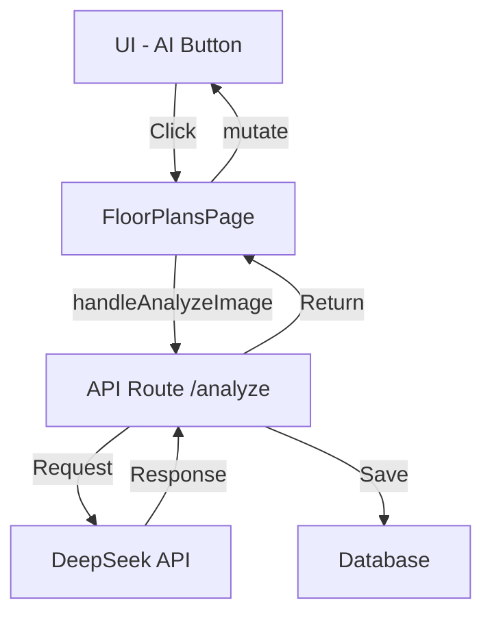

# Floor Plans AI Feature Architecture

## Overview
This document describes the architecture of the floor plans analysis feature using AI (DeepSeek API).

## Components Structure

### 1. UI Components
#### `FloorPlanEditor.tsx`
- Main component for floor plan editing
- Contains AI button with `IconRobot`
- Manages `isAnalyzing` state
- Props:
  ```typescript
  interface FloorPlanEditorProps {
    imageUrl: string;
    initialUnits: UnitPosition[];
    availableUnits: Unit[];
    onSaveUnits: (units: UnitPosition[]) => Promise<void>;
    isEditable: boolean;
    onAnalyzeImage: (imageUrl: string) => Promise<void>;
  }
  ```

### 2. Pages
#### `/[locale]/projects/[id]/buildings/[buildingId]/floor-plans/page.tsx`
- Handles image analysis logic
- Manages loading state
- Updates data after analysis
- Key functions:
  ```typescript
  const handleAnalyzeImage = async (imageUrl: string) => {
    // Sends analysis request
    // Updates UI with results
  };
  ```

### 3. API Endpoints
#### `/api/buildings/[buildingId]/floor-plans/[id]/analyze`
- **Method**: POST
- **Purpose**: Analyze floor plan image using DeepSeek API
- **Response**: SVG paths for unit boundaries
- **Error Handling**: Returns appropriate HTTP status codes

### 4. Database Schema (Prisma)
```prisma
model BuildingFloorPlan {
  id          String   @id @default(cuid())
  buildingId  String
  floor       Int
  media       Media?   @relation(fields: [mediaId], references: [id])
  mediaId     String?
  units       UnitPosition[]
  createdAt   DateTime @default(now())
  updatedAt   DateTime @updatedAt
}

model UnitPosition {
  id          String   @id @default(cuid())
  floorPlanId String
  unitId      String
  x           Float
  y           Float
  points      Json?    // Stores SVG paths
  rotation    Float?
  scale       Float?
  floorPlan   BuildingFloorPlan @relation(fields: [floorPlanId], references: [id])
  unit        Unit     @relation(fields: [unitId], references: [id])
  createdAt   DateTime @default(now())
  updatedAt   DateTime @updatedAt
}
```

### 5. Configuration
```env
DEEPSEEK_API_KEY=your_api_key_here
DEEPSEEK_API_URL=https://api.deepseek.com
```

## Data Flow



## Implementation Details

### 1. AI Analysis Process
1. User clicks AI button on floor plan
2. Frontend sends image URL to backend
3. Backend:
   - Retrieves image from storage
   - Sends to DeepSeek API
   - Processes response
   - Saves unit boundaries
   - Returns updated data

### 2. Data Storage
- Unit positions stored in `UnitPosition` table
- SVG paths stored in `points` field as JSON
- Each position linked to specific floor plan and unit

### 3. Error Handling
```typescript
try {
  // Analysis logic
} catch (error) {
  console.error('Error analyzing floor plan:', error);
  toast.error(`Failed to analyze floor plan: ${error instanceof Error ? error.message : 'Unknown error'}`);
}
```

## API Reference

### Analyze Floor Plan
```typescript
POST /api/buildings/:buildingId/floor-plans/:id/analyze

Response:
{
  success: boolean;
  data?: {
    units: Array<{
      id: string;
      points: Array<{x: number, y: number}>;
    }>;
  };
  error?: string;
}
```

## Dependencies
- NextUI for UI components
- SWR for data fetching
- Prisma for database operations
- DeepSeek API for image analysis

## Future Improvements
1. Add support for multiple floor plans
2. Implement batch analysis
3. Add progress tracking for analysis
4. Improve error handling and recovery
5. Add unit tests for critical paths 